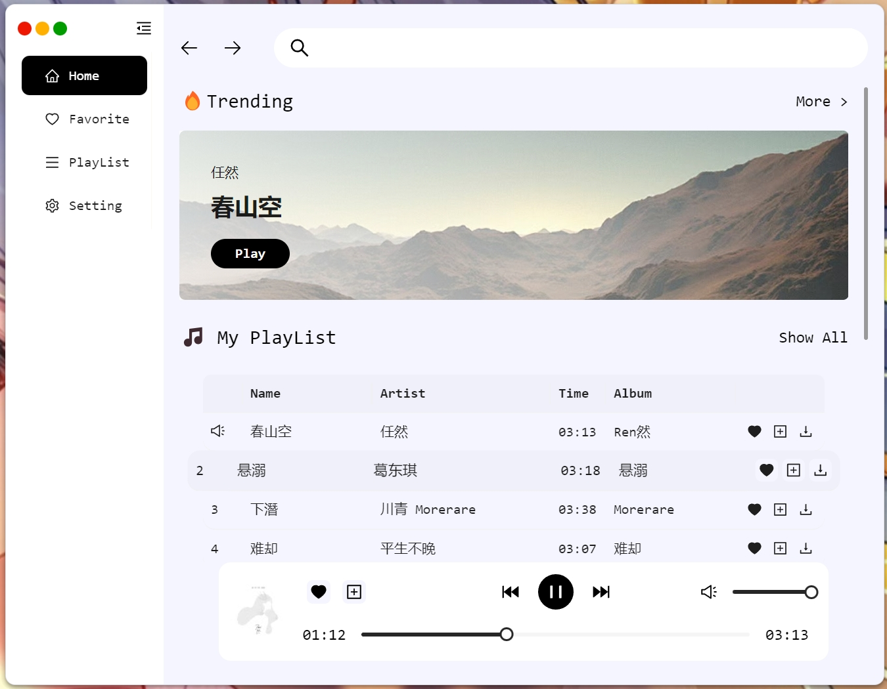

# YouTube Music Player
YouTube Music Player is an unofficial desktop application, designed to facilitate  searching, saving, and downloading of your favorite music from YouTube Music.

## Build With


## Installation

Use [npm](https://www.npmjs.com/) or [yarn](https://yarnpkg.com/) to install the dependencies.

```bash
npm install
# or
yarn install
```
## Usage
### Development
To launch the application in development mode:
```bash
npm run start
```
### Production Build
To build the application for production:
```bash
npm run build
```
After building, you can find the packaged application in the dist directory.

## Acknowledgments
[emresenyuva/youtube-music-api](https://github.com/emresenyuva/youtube-music-api)
[Bee Music - 🎵 Music Media Player Dashboard](https://dribbble.com/shots/16618273-Bee-Music-Music-Media-Player-Dashboard)

## License
[MIT License](https://choosealicense.com/licenses/mit/)